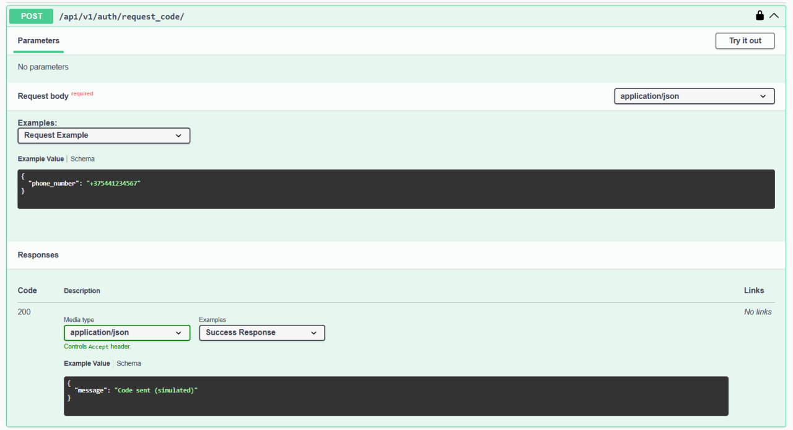
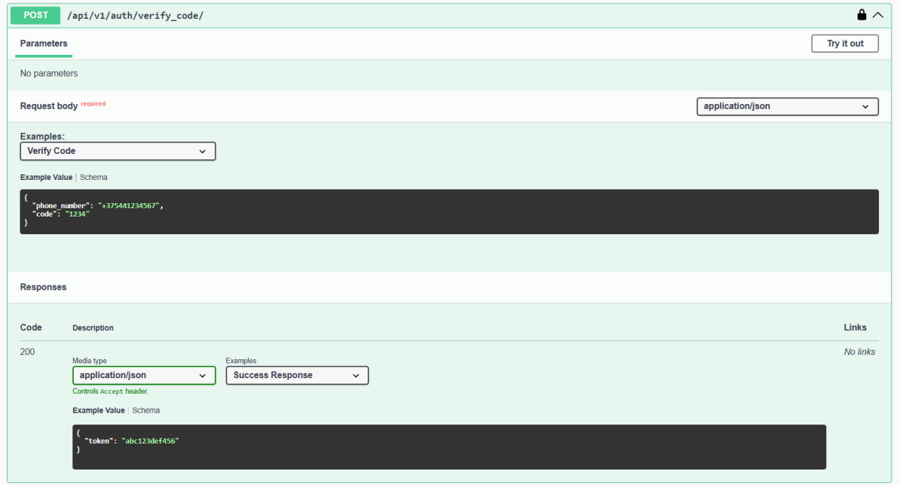
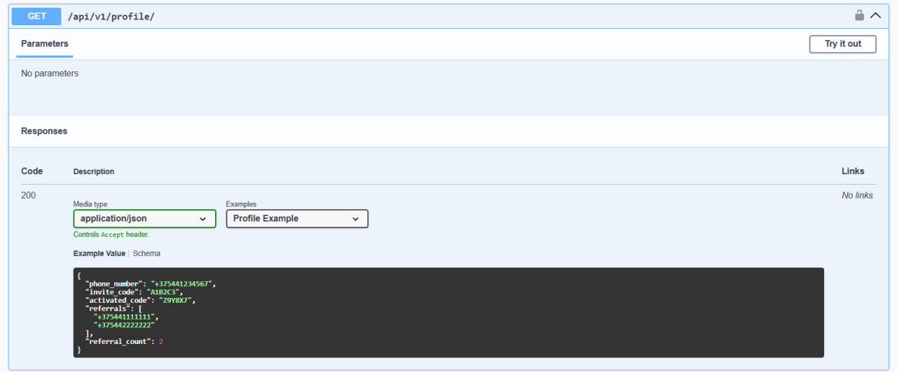
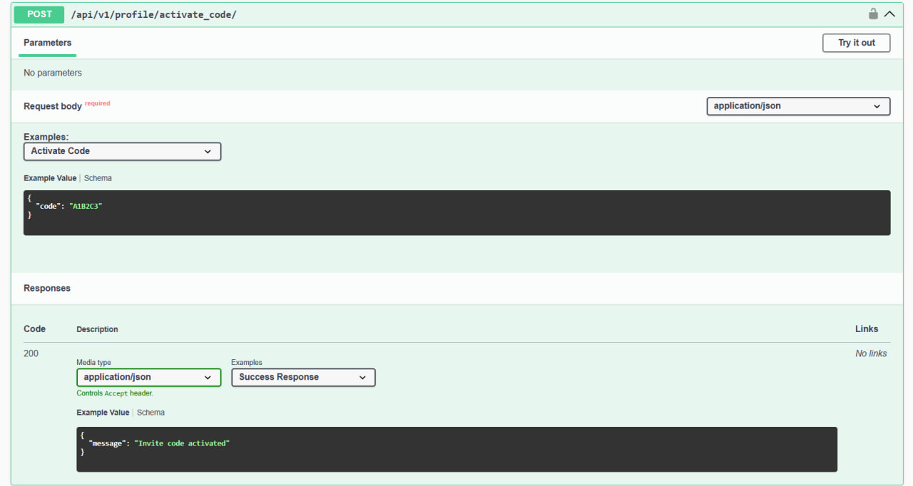
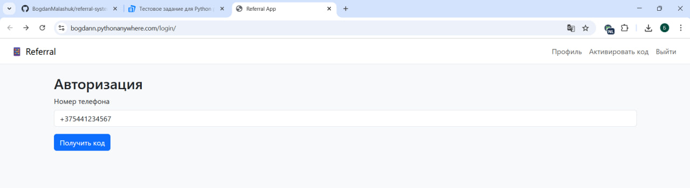
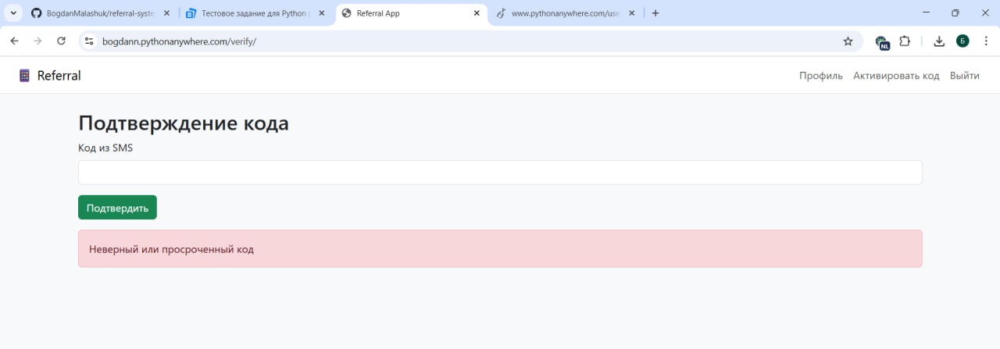
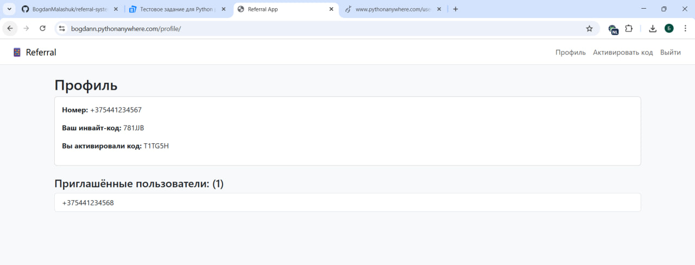
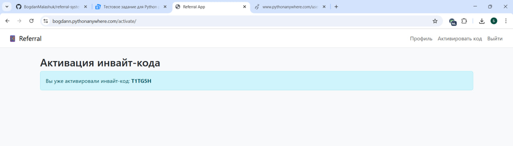
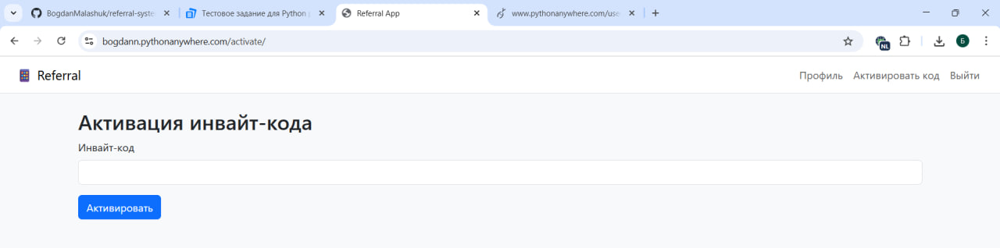

# 📱 Django Referral System

Простая реферальная система на Django + DRF с авторизацией по SMS-коду(симуляция) и возможностью активировать инвайт-код приглашённого пользователя.

---

## 🚀 Функциональность

- Регистрация по номеру телефона
- Подтверждение через 4-значный код (отправляется в консоль)
- Генерация уникального инвайт-кода при регистрации
- Активация чужого инвайт-кода
- Отображение профиля пользователя, включая:
  - его инвайт-код
  - чей код он активировал
  - список приглашённых пользователей
  - количество приглашённых
- API с документацией через Swagger и ReDoc

---

## 🛠 Используемые технологии

Python 3.12

Django 5.x

Django REST Framework

PostgreSQL

drf-spectacular (Swagger / OpenAPI 3)

---

## ⚙️ Установка и запуск

### 1. Клонировать репозиторий

```
git clone https://github.com/BogdanMalashuk/referral-system.git
cd referral-system
```

### 2. Установить зависимости

```
python -m venv .venv
.venv\Scripts\activate
pip install -r requirements.txt
```

### 3. Создать .env файл

```
DEBUG=True/False
SECRET_KEY=example_key
ALLOWED_HOSTS=host_1, host_2, ...

DB_NAME=example_name
DB_USER=example_user
DB_PASSWORD=example_password
DB_HOST=example_host
DB_PORT=5432
```

### 4. Применить миграции

```
python manage.py makemigrations
python manage.py migrate
```

### 5. Запустить сервер

```
python manage.py runserver
```
---

## 🔐 Аутентификация

Аутентификация происходит через токен (DRF TokenAuthentication).

Все защищённые эндпоинты требуют заголовок:
```
Authorization: Token <your_token>
```

---

## 🧪 API Документация (Swagger UI)
❗Для получения JSON схемы, ReDoc документации запустите проект локально
и воспользуйтесь ссылками❗

Авторизация в системе: 


Верификация кода:


Получение профиля


Активация инвайт-кода


---

## 🖼️ Шаблоны

Страница авторизации:


Верификация кода:


Страница профиля:


Инвайт-код (активирован)


Инвайт-код (не активирован)



